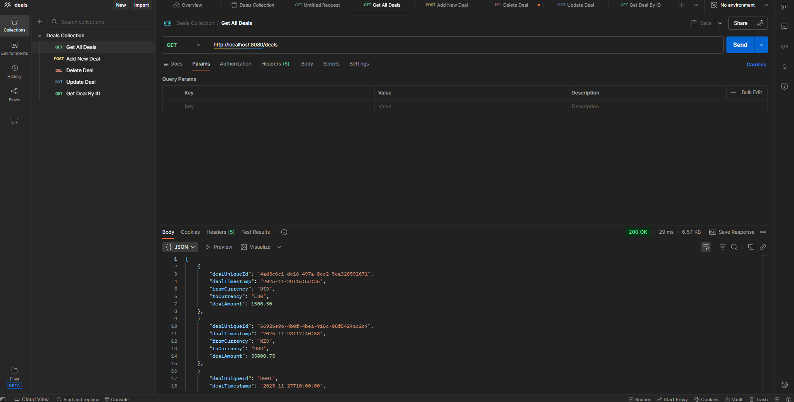
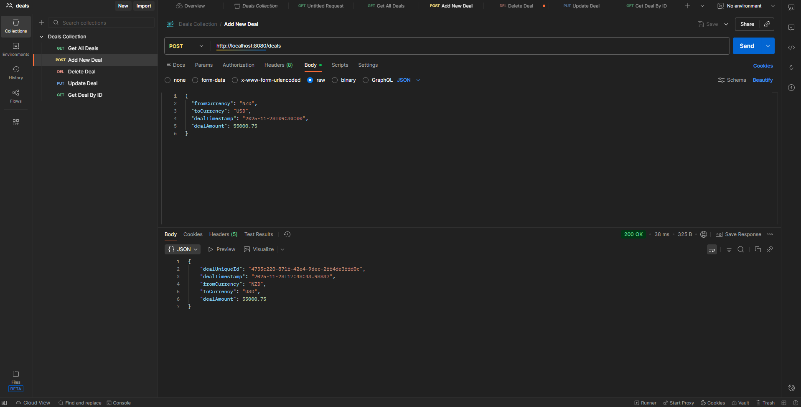
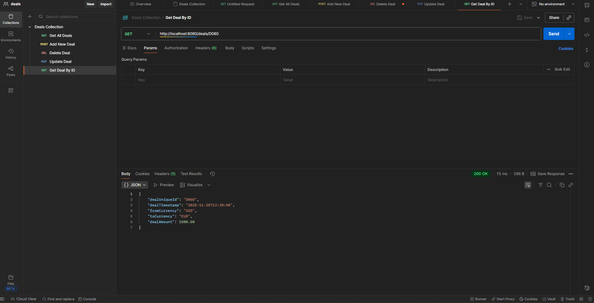
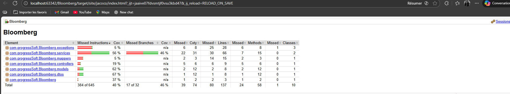
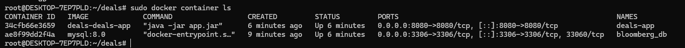

# Spring Boot MySQL Docker Project

## Project Description
This project focuses on developing a **Deal Management API** as part of a Bloomberg engineering team.

**Key Features:**
- Receive incoming **FX deal details** through a REST API
- Validate the structure and content of each deal
- Ensure each deal is **unique** using its `Deal Unique Id`
- Persist valid deals into a relational **database** for future analytics, reporting, and fraud detection

---

## Technologies Used
- **Backend:** Java 21, Spring Boot, Maven
- **Database:** MySQL 8
- **Containerization:** Docker, Docker Compose
- **API Testing:** Postman
- **Build Tool:** Maven
- **OS/Environment:** Compatible with Linux, Windows

---

## Postman Captures
Below are sample captures from Postman showing API requests and responses.

**1. GET All Deals**  


**2. POST Add  New Deal**  


**3. GET Deal By Id**  


**4. PUT Update Deal**  


**5. DELETE Deal**  


***YOU WILL FIND THE POSTMAN'S COLLECTION in Deals_Collection_Postman.json***

---

## Jacoco Report

**Jacoco Report**  


---

## Docker Configuration

### Dockerfile (Multi-stage build)
```dockerfile
FROM  maven:3.9-eclipse-temurin-21-alpine AS build


WORKDIR /app

COPY pom.xml .
COPY mvnw .
COPY .mvn .mvn
COPY src ./src
RUN mvn clean package -DskipTests

FROM eclipse-temurin:21-jre-alpine
WORKDIR /app
COPY --from=build /app/target/*.jar app.jar
EXPOSE 8080
ENTRYPOINT ["java","-jar","app.jar"]
```
## Docker Compose Configuration

### Docker Compose (Build and run image and run mysql database)
```docker-compose.yml
version: '3.8'
services:
  db:
    image: mysql:8.0
    container_name: bloomberg_db
    environment:
      MYSQL_ROOT_PASSWORD: root
      MYSQL_DATABASE: bloomberg_db
    ports:
      - "3306:3306"
  deals-app:
    build:
      context: .
      dockerfile: Dockerfile
    container_name: deals-app
    ports:
      - "8080:8080"
    environment:
      SPRING_DATASOURCE_URL: jdbc:mysql://db:3306/bloomberg_db
      SPRING_PROFILES_ACTIVE: dev
    depends_on:
      - db
```
## Containers running

